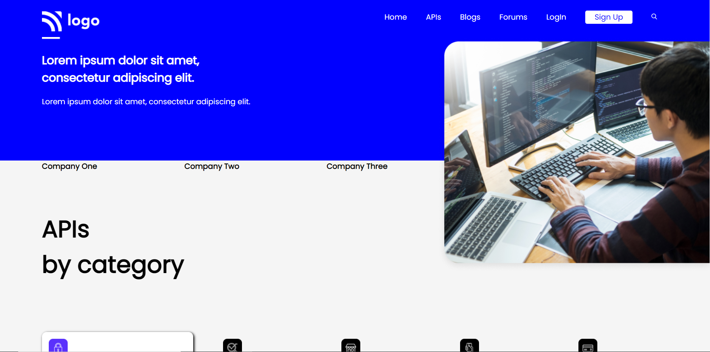

# Project 09 - HTML and CSS

By Piyush Bhatt

Deployed link of website &nbsp; 

 

# [Link to Project 09](devloper-landingpage.netlify.app)

 

# Preview of the Project.

 

## What I learnt in this Project?

- I learned about how to make website **layout** through **flexbox.**
- I also learnt about how to make **cards** using flex properties.
- I also learnt how to use **Hover property** on existing element.
- I also learnt to play with **border radius**.
- I also learnt how to create **box container** and how to give them a **shadow** to give them real look.

  

# Time Taken to complete  this project is 11 hour.